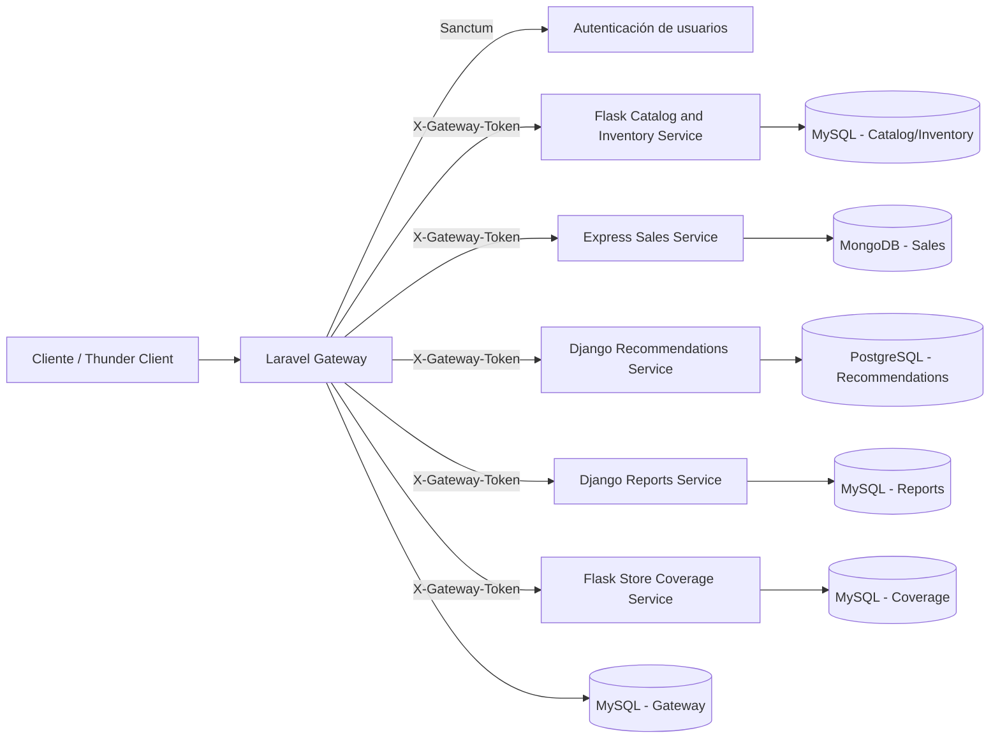

# Arquitectura del sistema

## Descripción general

El sistema fue desarrollado con una arquitectura basada en microservicios. Su objetivo es gestionar autenticación, catálogo e inventario, ventas, recomendaciones, reportes y cobertura de tiendas a través de un único punto de acceso: el **API Gateway**.

La solución está compuesta por seis servicios principales:

* **Laravel Gateway**
* **Catalog and Inventory Service** en **Flask**
* **Sales Service** en **Express**
* **Recommendations Service** en **Django**
* **Reports Service** en **Django**
* **Store Coverage Service** en **Flask**

Cada servicio tiene responsabilidades específicas, utiliza su propia tecnología y trabaja con su propia base de datos.

## Componentes del sistema

### 1. Laravel Gateway

El gateway es el punto de entrada principal del sistema. Todas las solicitudes del cliente deben pasar por este servicio.

Sus responsabilidades son:

* registrar usuarios
* iniciar sesión
* cerrar sesión
* recuperar o restablecer contraseña
* validar autenticación con Sanctum
* exponer endpoints protegidos al cliente
* comunicarse con los microservicios internos
* orquestar el flujo principal de venta
* centralizar la integración de recomendaciones, reportes y cobertura de tiendas

Base de datos utilizada:

* **MySQL** local mediante **Laragon**

### 2. Catalog and Inventory Service (Flask)

Este microservicio se encarga de la gestión de productos e inventario.

Sus responsabilidades son:

* registrar productos
* listar productos
* consultar productos por id
* actualizar productos
* eliminar productos
* consultar stock
* aumentar stock
* disminuir stock

Base de datos utilizada:

* **MySQL** local mediante **Laragon**

### 3. Sales Service (Express)

Este microservicio se encarga de la gestión de ventas.

Sus responsabilidades son:

* registrar ventas
* listar ventas
* consultar ventas por id
* consultar ventas por usuario
* consultar ventas por rango de fechas

Base de datos utilizada:

* **MongoDB** local

### 4. Recommendations Service (Django)

Este microservicio se encarga de generar recomendaciones a partir de la información de productos y ventas que el gateway le envía.

Sus responsabilidades son:

* recomendar productos más vendidos
* recomendar productos comprados previamente por el usuario
* recomendar productos por precio máximo

Base de datos utilizada:

* **PostgreSQL** local

### 5. Reports Service (Django)

Este microservicio se encarga de generar reportes a partir de las ventas que el gateway le envía.

Sus responsabilidades son:

* generar reporte de ventas totales
* generar reporte de ventas por producto
* generar reporte de ventas por usuario

Base de datos utilizada:

* **MySQL** local mediante **Laragon**

### 6. Store Coverage Service (Flask)

Este microservicio se encarga de gestionar tiendas físicas y su relación con los productos disponibles en cada una.

Sus responsabilidades son:

* registrar tiendas
* listar tiendas
* consultar tiendas por id
* filtrar tiendas por ciudad
* filtrar tiendas por producto

Base de datos utilizada:

* **MySQL** local mediante **Laragon**

## Regla de comunicación

La arquitectura sigue una regla principal:

* el cliente **solo se comunica con el Laravel Gateway**
* los microservicios **no son consumidos directamente por el cliente**
* el gateway se comunica internamente con los microservicios
* los microservicios **no se comunican entre sí directamente**

Esto significa que el gateway es el encargado de coordinar operaciones entre servicios, especialmente en el flujo principal de ventas y en la integración de recomendaciones y reportes.

## Autenticación y seguridad

El sistema utiliza dos mecanismos de seguridad distintos:

### 1. Sanctum para usuarios

El Laravel Gateway utiliza **Laravel Sanctum** para autenticar usuarios.

Este mecanismo se usa para:

* registro de usuario
* inicio de sesión
* cierre de sesión
* protección de endpoints del gateway
* obtención del usuario autenticado

### 2. Token interno de servicio

La comunicación entre el gateway y los microservicios Flask, Express y Django está protegida mediante un token interno de servicio.

Este token se envía en el header:

* `X-Gateway-Token`

Su propósito es garantizar que los microservicios solo acepten solicitudes provenientes del gateway.

## Flujo general de comunicación

La comunicación general del sistema funciona así:

1. El cliente envía la solicitud al Laravel Gateway.
2. El gateway valida la autenticación del usuario cuando la ruta lo requiere.
3. El gateway procesa la solicitud o la redirige al microservicio correspondiente.
4. El microservicio responde al gateway.
5. El gateway devuelve la respuesta final al cliente.

## Flujo principal de una venta

Cuando se procesa una venta, el sistema sigue esta secuencia:

1. El cliente envía la solicitud de venta al Laravel Gateway.
2. El gateway valida la autenticación del usuario con Sanctum.
3. El gateway obtiene el usuario autenticado.
4. El gateway consulta el producto en el Catalog and Inventory Service.
5. El gateway verifica que exista stock suficiente.
6. El gateway registra la venta en el Sales Service.
7. El gateway descuenta el stock en el Catalog and Inventory Service.
8. El gateway devuelve una respuesta consolidada al cliente.

## Integración de recomendaciones

El sistema también cuenta con un flujo de integración para recomendaciones:

1. El cliente realiza la solicitud al gateway.
2. El gateway consulta productos y ventas en los microservicios ya integrados.
3. El gateway envía esa información al Recommendations Service.
4. El Recommendations Service procesa la lógica de recomendación.
5. El gateway devuelve la respuesta al cliente.

## Integración de reportes

El sistema también cuenta con un flujo de integración para reportes:

1. El cliente realiza la solicitud al gateway.
2. El gateway consulta las ventas en el Sales Service.
3. El gateway envía esa información al Reports Service.
4. El Reports Service procesa el reporte solicitado.
5. El gateway devuelve la respuesta al cliente.

## Tecnologías por servicio

### Laravel Gateway

* Laravel 12.x
* PHP 8.3.16
* Composer 2.8.9
* MySQL
* Sanctum

### Catalog and Inventory Service

* Python 3.13.3
* Flask
* MySQL

### Sales Service

* Node.js 22.15.0
* Express
* MongoDB 8.2.5

### Recommendations Service

* Python 3.13.3
* Django
* PostgreSQL 18.3

### Reports Service

* Python 3.13.3
* Django
* MySQL

### Store Coverage Service

* Python 3.13.3
* Flask
* MySQL

## Diagrama de arquitectura

