# Análisis de resultados de pruebas de rendimiento

## 1. Objetivo

Evaluar el comportamiento del sistema **Microservices Commerce Platform** bajo tres escenarios de rendimiento ejecutados con **Locust**: **carga**, **capacidad** y **estrés**.  
Las pruebas se realizaron consumiendo el sistema a través del **API Gateway**, utilizando un conjunto de endpoints representativos del flujo general de negocio.

## 2. Herramienta utilizada

Las pruebas se ejecutaron con **Locust**, una herramienta de pruebas de rendimiento orientada a usuarios concurrentes.  
Esta herramienta permitió simular tráfico concurrente sobre varios endpoints del sistema y observar métricas como:

- número total de solicitudes procesadas
- tasa de solicitudes por segundo (**RPS**)
- tiempos de respuesta promedio
- percentiles de respuesta (p95 y p99)
- cantidad de fallos

## 3. Metodología aplicada

Se definió un escenario único de prueba con **10 endpoints GET** del sistema, todos consumidos a través del gateway.  
Para evitar alteraciones innecesarias sobre la base de datos, se eligieron únicamente endpoints de consulta.

Antes de ejecutar las pruebas, se utilizó un script de preparación de datos (`setup_test_data.py`) para generar los datos mínimos de prueba:

- usuario de testing
- producto de testing
- tienda de testing
- venta de testing

Posteriormente se ejecutó un único `locustfile.py` bajo tres configuraciones distintas:

- **Prueba de carga**
- **Prueba de capacidad**
- **Prueba de estrés**

## 4. Endpoints evaluados

Los endpoints incluidos en las pruebas fueron:

1. `GET /api/products`
2. `GET /api/products/{product_id}`
3. `GET /api/products/{product_id}/stock`
4. `GET /api/sales`
5. `GET /api/sales/user/{user_id}`
6. `GET /api/recommendations/top-selling`
7. `GET /api/recommendations/user`
8. `GET /api/reports/total-sales`
9. `GET /api/reports/sales-by-product`
10. `GET /api/stores`

## 5. Configuración de las pruebas

### 5.1 Prueba de carga
- Usuarios concurrentes: **4**
- Spawn rate: **1 usuario/segundo**
- Duración: **6 minutos**

### 5.2 Prueba de capacidad
- Usuarios concurrentes: **6**
- Spawn rate: **1 usuario/segundo**
- Duración: **6 minutos**

### 5.3 Prueba de estrés
- Usuarios concurrentes: **10**
- Spawn rate: **1 usuario/segundo**
- Duración: **6 minutos**

---

## 6. Resultados de la prueba de carga

### 6.1 Métricas agregadas observadas

- Requests totales: **745**
- Fallos: **0**
- RPS agregado: **2.1**
- Tiempo promedio agregado: **424.48 ms**
- p95 agregado: **720 ms**
- p99 agregado: **860 ms**
- Tiempo máximo agregado: **1131 ms**

### 6.2 Lectura de resultados

La prueba de carga mostró un comportamiento estable del sistema.  
Durante los 6 minutos de ejecución no se registraron fallos y la tasa de procesamiento se mantuvo constante. Los tiempos de respuesta agregados permanecieron en valores aceptables para un escenario de carga moderada.

Los endpoints con mayor tiempo promedio fueron:

- `GET /api/products/{product_id}` → **459.59 ms**
- `GET /api/recommendations/user` → **441.55 ms**
- `GET /api/stores` → **434.57 ms**

Aun así, ninguno de ellos presentó degradación severa ni comportamientos anómalos.

### 6.3 Interpretación

Bajo una carga moderada de **4 usuarios concurrentes**, el sistema respondió de forma correcta, estable y sin errores.  

### 6.4 Evidencia gráfica
#### Estadísticas
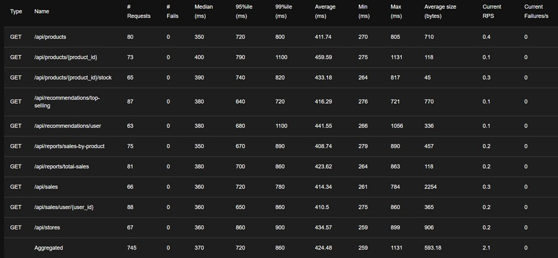

#### Total Requests per Second
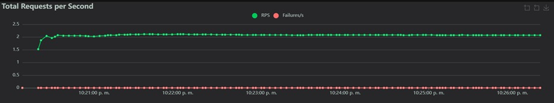

#### Response Times
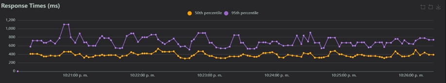

#### Number of Users
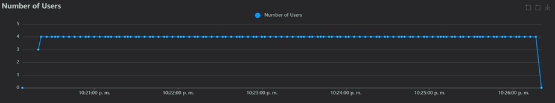

---

## 7. Resultados de la prueba de capacidad

### 7.1 Métricas agregadas observadas

- Requests totales: **994**
- Fallos: **0**
- RPS agregado: **3**
- Tiempo promedio agregado: **642.16 ms**
- p95 agregado: **970 ms**
- p99 agregado: **1700 ms**
- Tiempo máximo agregado: **16137 ms**

### 7.2 Lectura de resultados

La prueba de capacidad mantuvo el sistema operativo y sin errores, pero ya mostró señales más claras de presión.  
Aunque el throughput agregado se sostuvo alrededor de **3 RPS**, la latencia aumentó frente a la prueba de carga.

Los endpoints con mayor tiempo promedio fueron:

- `GET /api/reports/total-sales` → **731.89 ms**
- `GET /api/recommendations/user` → **724.64 ms**
- `GET /api/products/{product_id}/stock` → **718.54 ms**
- `GET /api/sales` → **713.62 ms**

Además, en ejecuciones repetidas de esta misma prueba se observaron **picos aislados de latencia**, lo que sugiere que este nivel de concurrencia ya se encuentra cerca del límite operativo del sistema.

### 7.3 Interpretación

Con **6 usuarios concurrentes**, el sistema todavía logra responder sin fallos, pero ya no lo hace con la misma comodidad observada en la prueba de carga.  
La latencia más alta y la presencia de picos aislados en ejecuciones repetidas indican que este escenario representa de forma razonable la **capacidad práctica** del sistema en su configuración actual.

### 7.4 Evidencia gráfica
#### Estadísticas
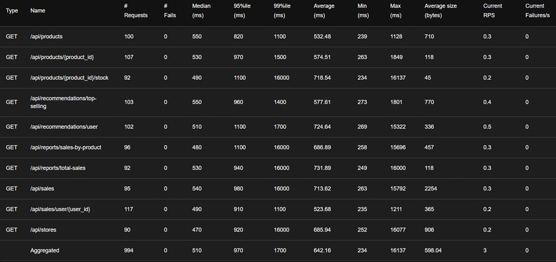

#### Total Requests per Second
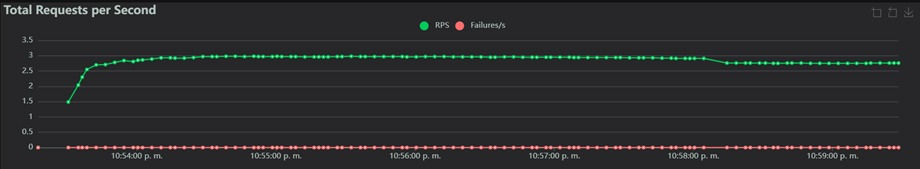

#### Response Times
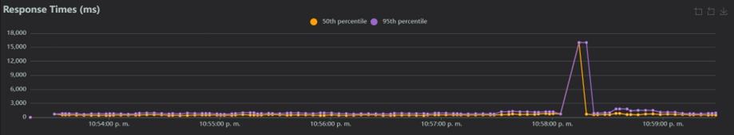

#### Number of Users
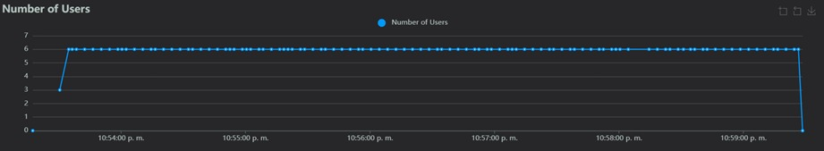

---

## 8. Resultados de la prueba de estrés

### 8.1 Métricas agregadas observadas

- Requests totales: **1028**
- Fallos: **0**
- RPS agregado: **2.6**
- Tiempo promedio agregado: **1968.28 ms**
- p95 agregado: **2900 ms**
- p99 agregado: **3600 ms**
- Tiempo máximo agregado: **4389 ms**

### 8.2 Lectura de resultados

En la prueba de estrés el sistema no presentó fallos explícitos, pero sí mostró una degradación fuerte del rendimiento.  
Al aumentar la concurrencia a **10 usuarios**, el throughput no creció proporcionalmente y, por el contrario, cayó ligeramente respecto a la prueba de capacidad, mientras que la latencia se incrementó de forma marcada.

Los endpoints con mayor tiempo promedio fueron:

- `GET /api/stores` → **2051.76 ms**
- `GET /api/products` → **2021.51 ms**
- `GET /api/recommendations/top-selling` → **1970.03 ms**
- `GET /api/recommendations/user` → **1969.77 ms**
- `GET /api/reports/total-sales` → **1965.35 ms**

### 8.3 Interpretación

Aunque no se observaron errores HTTP, la combinación de:

- aumento drástico en los tiempos de respuesta,
- descenso del throughput frente a la prueba de capacidad,
- y percentiles altos cercanos a los **3 segundos** y superiores,

indica que el sistema entra en una zona de **saturación** bajo este nivel de concurrencia.  

### 8.4 Evidencia gráfica
#### Estadísticas
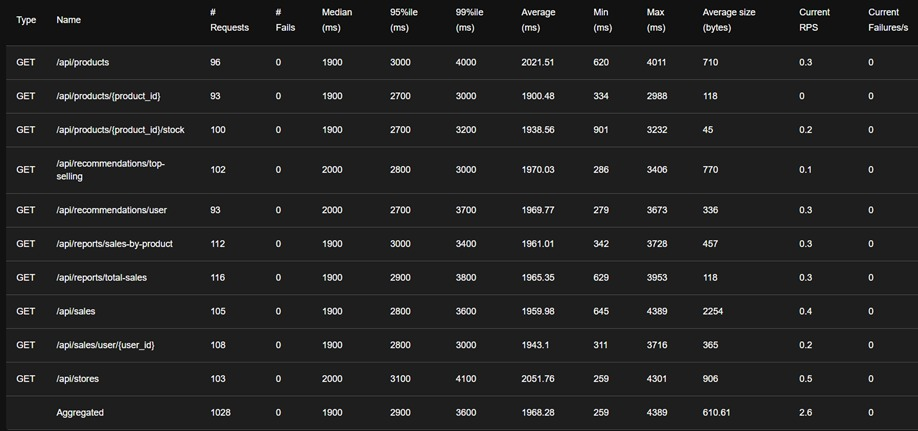

#### Total Requests per Second
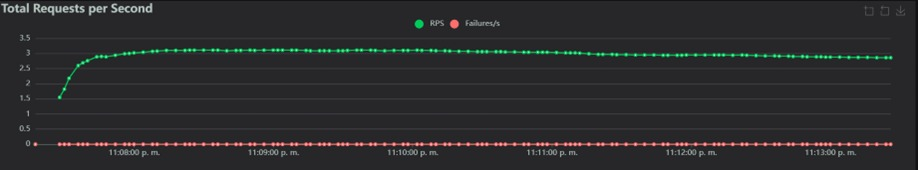

#### Response Times
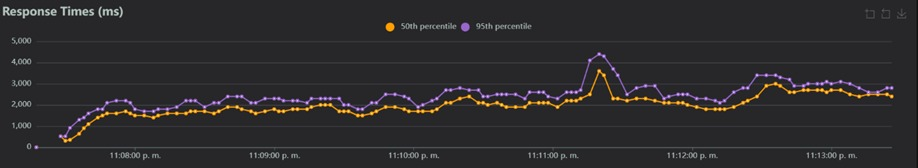

#### Number of Users
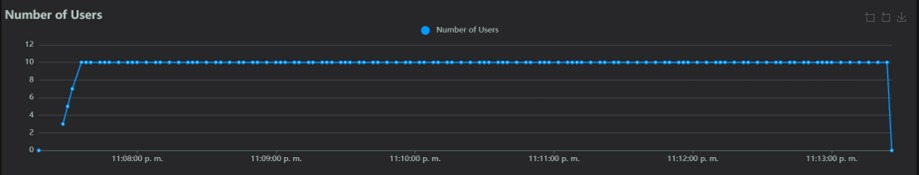

---

## 9. Hallazgos generales

A partir de las tres pruebas ejecutadas, se identificaron los siguientes hallazgos:

- El sistema se comporta de forma estable en escenarios de carga moderada.
- La capacidad práctica del sistema se ubica alrededor de **6 usuarios concurrentes**.
- A partir de **10 usuarios concurrentes**, el sistema sigue respondiendo, pero con una degradación fuerte de la latencia.
- El throughput no escala de forma proporcional al incremento de usuarios, lo que sugiere la existencia de cuellos de botella en la arquitectura actual.
- Los endpoints relacionados con **reportes**, **recomendaciones** y algunas consultas de **productos** tienden a concentrar los tiempos de respuesta más altos.

## 10. Conclusiones

Las pruebas de rendimiento permiten concluir que el sistema:

- **sí soporta una carga moderada** de uso concurrente,
- **mantiene funcionamiento aceptable** cerca de los 6 usuarios concurrentes,
- pero **presenta saturación** cuando la concurrencia aumenta hasta 10 usuarios.

En términos prácticos:

- **Carga**: 4 usuarios concurrentes  
- **Capacidad**: 6 usuarios concurrentes  
- **Estrés**: 10 usuarios concurrentes  

Esto no significa que el sistema colapse inmediatamente, sino que, a partir del nivel de estrés evaluado, los tiempos de respuesta dejan de ser competitivos y el crecimiento del throughput ya no compensa el incremento de usuarios.
